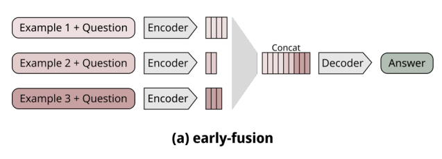
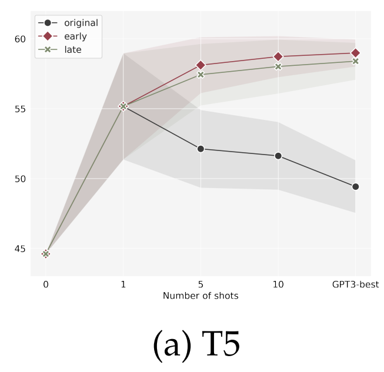

# T5-XL 모델을 사용한 한국어-점자 번역 모델 훈련

본 레포지터리는 T5-XLarge 모델(3B)을 사용한 한국어-점자 번역 모델 훈련을 위한 코드를 담고 있습니다.

## 환경 설정

### 요구 사양
- Python 3.10+
- Cuda 12.4+
- PyTorch 2.11+
- Transformers 4.45.2+
- 40GB+ GPU 권장

필요 라이브러리 설치:
```
pip install -r requirements.txt
```

## 간편한 실행
### 훈련 스크립트 실행
1. `dataset/` 폴더에 학습 데이터를 준비합니다.
2. `train.sh` 파일에 훈련 파라미터를 설정합니다.
3. 훈련을 실행합니다.
```
chmod +x train.sh
./train.sh
```

### 평가 스크립트 실행
1. `benchmark.sh` 파일에 huggingface hub에 업로드 한 모델 이름 또는 local에 저장한 모델 경로를 설정합니다.
2. 사용하고자 하는 모델의 특정 버전이 있을 경우, `revision` 파라미터를 설정합니다. 
3. 모델 평가에 사용할 데이터셋을 `benchmark_path` 파라미터에 설정합니다.
4. 평가를 실행합니다.
```
chmod +x benchmark.sh
./benchmark.sh
```

## 훈련 결과
### 점역 교정사 기출 문제 벤치마크 점수
자체 수집한 국가 공인 자격증 시험 <점역 교정사>의 기출 문제 159문항을 자체 수집하여 평가 데이터로 사용하였습니다.
<div align="center">

| Metric          | Value               |
|------------------|--------------------|
| Correct         | 136/159             |
| Correct Rate    | 0.8553              |
| WER             | 0.0422              |
| CER             | 0.0139              |
| **BLEU**            | **0.9383**              |
</div>

약 100만쌍의 학습 데이터를 사용한 [중국 점자 번역 모델의 성능(92.23 BLEU)](https://www.sciencedirect.com/science/article/abs/pii/S0141938223000781)과 비교하였을 때, 본 프로젝트의 한국어 점자 번역 모델의 성능이 상당히 높은 수준임을 알 수 있습니다.

### few-shot ICL 추론
Auto-regressive 모델에서 주로 사용되는 few-shot In-context Learning(ICL)을 수행합니다. 논문 [Exploiting the Potential of Seq2Seq Models as Robust Few-Shot Learners](https://arxiv.org/abs/2305.18354)에서 소개된 방법을 참고하여 **early-fusion 기법**을 사용하였습니다. <br>
few-shot ICL과 zero-shot의 성능을 비교하기 위하여, few-shot 예시가 반영되지 않은 zero-shot 결과도 함께 표시됩니다.



하지만 few-shot ICL의 사용은 점역 모델의 성능 저하를 가져왔습니다. 논문에서 실험에 사용한 T5 모델의 최소 규모가 11B라는 점을 감안하였을 때: <br>
1) 본 프로젝트의 T5-xlarge(3B) 모델의 작은 규모 <br>
2) 컴퓨팅 리소스 제한으로 인한 비교적 작은 max_length의 한계가 성능 저하의 원인으로 예상됩니다.

## 폴더 구조
```
t5-xlarge/
├── main.py                   # 한국어-점자 번역 모델 훈련 스크립트
├── train.sh                  # 모델 훈련 실행 스크립트
├── benchmark.py              # 모델 평가 스크립트
├── benchmark.sh              # 모델 평가 실행 스크립트
├── early-fusion-ICL        
│   ├── fewshot_inference.py  # Early-fusion을 사용한 few-shot ICL 추론 스크립트
│   └── fewshot_inference.sh  # Early-fusion을 사용한 few-shot ICL 추론 실행 스크립트
├── utils
│   ├── data.py               # 훈련 데이터 전처리 스크립트
│   ├── automated_upload.py   # 모델 자동 업로드 스크립트
│   └── special_braille.txt   # special token으로 추가할 점자 목록 .txt 파일
├── requierments.txt
├── README.md
└── LICENSE
```

### few-shot ICL 추론 스크립트 실행
1. `fewshot_inference.sh` 파일에 huggingface hub에 업로드 한 모델 이름 또는 local에 저장한 모델 경로를 설정합니다.
2. 사용하고자 하는 모델의 특정 버전이 있을 경우, `revision` 파라미터를 설정합니다. 
3. `fewshot_path` 파라미터에 few-shot 예시가 있는 텍스트 파일 경로를 설정합니다.
4. `target_input` 파라미터에 추론할 한국어 문장을 설정합니다.
5. Early-fusion few-shot In-context Learning을 활용한 추론을 실행합니다.
```
chmod +x fewshot_inference.sh
./fewshot_inference.sh
```

### 사용 데이터
본 프로젝트에서는 국립 국어원에서 제공하는 묵자-점자 병렬 말뭉치 2023을 사용합니다. 이 데이터셋은 한국어 텍스트와 그에 대응하는 점자 번역을 포함하고 있으며, 모델 훈련 및 평가에 사용됩니다.

- **데이터 형식**: JSON
- **데이터 크기**: 약 125,000쌍 한국-점자 병렬 문장
- **사용 권한**: 연구 및 기술 개발용으로 승인된 목적에 한하여 사용 가능
- **출처**: [국립 국어원](https://kli.korean.go.kr/)


### 베이스 모델
본 프로젝트는 huggingface hub에 업로드 된`sangmin6600/t5-v1_1-xl-ko` 를 fine-tuning한 모델을 사용하였습니다.

fine-tuning을 진행할 베이스 모델 변경을 원할 경우, train.sh 파일의 `--model_name`과 `--tokenizer_name` 파라미터를 수정하세요.
예시:
```
MODEL_NAME=${MODEL_NAME:-"사용할 모델 이름"}
TOKENIZER_NAME=${TOKENIZER_NAME:-"사용할 토크나이저 이름"}
```

## 연락처
질문 또는 이슈가 있을 경우, Github 이슈를 생성해주세요.

### 참고 문헌
- Few-shot ICL에 사용된 방법은 논문 "Exploiting the Potential of Seq2Seq Models as Robust Few-Shot Learners"에 기재된 방법을 사용하였으며, 코드는 직접 구현하였습니다. 해당 논문은 [arXiv:2305.18354](https://arxiv.org/abs/2305.18354)에서 확인할 수 있습니다.
- 벤치마크 비교에는 논문 "Translating Braille into Chinese based on improved CBHG model"이 포함되어 있으며, 해당 논문은 [ScienceDirect](https://www.sciencedirect.com/science/article/abs/pii/S0141938223000781)에서 확인할 수 있습니다.